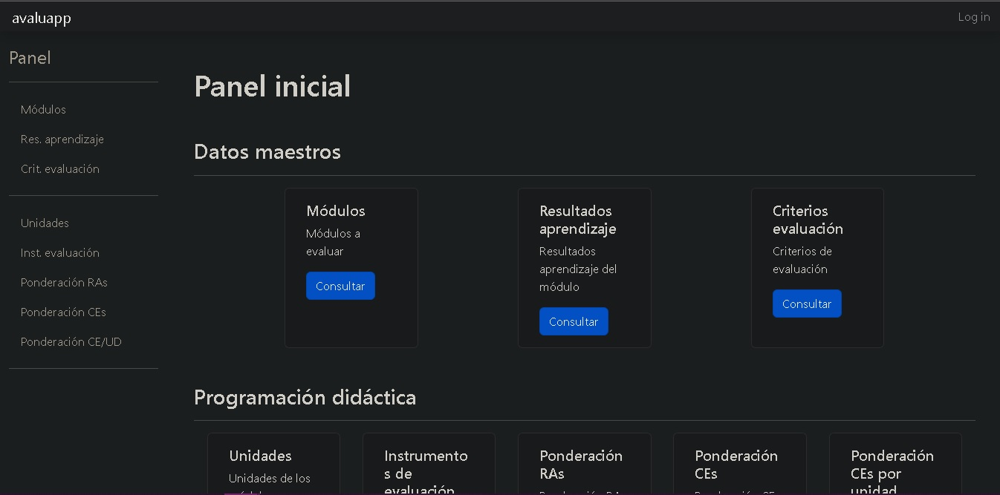

# Cómo crear Mi Portfolio en Django

Para consultar la documentación visita [Instalación Django Paso por Paso](https://drive.google.com/file/d/1uN34NHsJH79Jvxwn1-WGeTTKxI08bWwa/view?usp=share_link).

## Comandos

Con estos comandos conseguirás crear **tu primer proyecto** en Django.

1. `python3 -m venv [venv-name]` - Crear el entorno virtual.
2. `source [venv-name]/Scripts/activate` - Activar el entorno virtual.
3. `pip install Django==3.2` - Instalar la versión de Django 3.2.
4. `pip freeze > requirements.txt` - Creamos el fichero requirements y comprobamos que contiene las versiones concretas necesarias para reinstalar nuestro proyecto.
5. `django-admin startproject [project-name]` - Creamos el primer proyecto Django.

***

## Project layout

Este es un breve ejemplo de la estructura de carpetas que puedes tener nada más comenzar tu aplicación.

    portFolioDjango/
        __pycache__/
        __init__.py         # Archivo de configuración de importación.
        asgi.py             # Archivo de configuración utilizado para definir una aplicación ASGI y sus entornos de ejecución.
        settings.py         # Archivo de configuración y personalización de la aplicación web y del entorno de ejecución.
        urls.py             # Archivo de configuración que contiene una lista de patrones de URL y sus correspondientes vistas, utilizado para definir y gestionar las URL's de la aplicación web y controlar el comportamiento de la aplicación cuando se visitan esas URL's.
        wsgi.py              # Archivo de configuración utilizado para definir una aplicación WSGI y sus entornos de ejecución.
        templates/
            portfolio/       # Directorio de la app portfolio
                base.html    # Fichero html que servirá de base al resto.
                categorias_dropdown.html
                contacto.html
                footer.html  # Fichero html de footer
                header.html  # Fichero html de header
                home.html    # Fichero html de homepage
                proyecto.html
                year.html
            400.html         # Fichero html de error común
            403.html         # Fichero html de error común
            404.html         # Fichero html de error común
            500.html         # Fichero html de error común
        db.sqlite3           # Archivo de bd
        manage.py            # Archivo ejecutable utilizado para ejecutar tareas de administración y mantenimiento de la aplicación.
        ...                  # Otras páginas, imágenes y archivos.

---

## Tareas con manage.py

Estas son algunas de las tareas que puedes realizar con el fichero *manage.py*

* `python3 manage.py runserver` - Iniciar el servidor de desarrollo de Django.
* `python3 manage.py migrate` - Crear una base de datos nueva o actualizar la base de datos existente.
* `python3 manage.py startapp [appname]` - Crear una nueva aplicación.
* `python3 manage.py startproject [projectname]` - Crear un nuevo proyecto.
* `python3 manage.py test [appname]` - Ejecutar pruebas con una aplicación de pruebas.
* `python3 manage.py test [modulname]` - Ejecutar pruebas con un módulo de pruebas.
* `python3 manage.py createsuperuser` - Crear un superusuario de Django.
* `python3 manage.py help` - Ver una lista de todos los comandos disponibles.
* `python3 manage.py runserver --port 8080` - Iniciar el servidor de desarrollo de Django en un puerto específico.
* `python3 manage.py migrate --noinput` - Crear una base de datos nueva evistando que se soliciten entradas adicionales al usuario.

___

## Qué se podrá realizar con esta guía

|                Podrás                | No podrás              |
| :----------------------------------: | :--------------------- |
|     Realizar tu propio portfolio     | Alimentar a tu mascota |
| Realizar otros proyectos con Django  | Conseguir empleo       |
| Crear tu propia aplicación en Django |                        |

***

Y para finalizar, nuestra máxima siempre es:
> No es un bug, es una característica no documentada (Alan J. Perlis).

